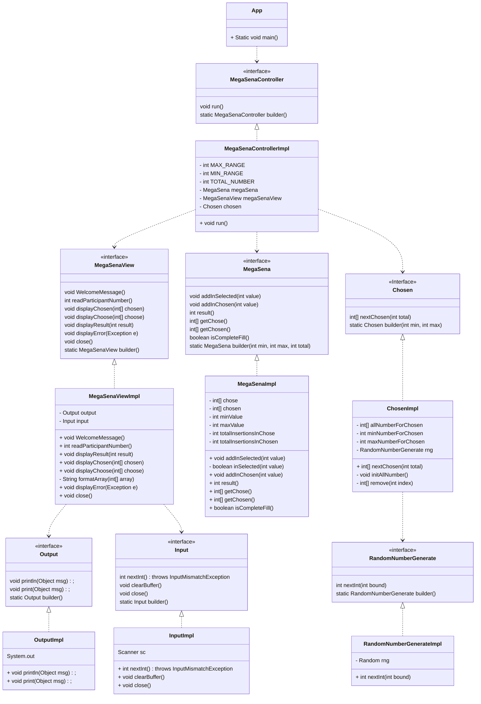

# MEGA-SENA EM JAVA

Este projeto foi desenvolvido como parte do curso de backend com Java no Vai na Web. A aplicação simula um jogo da MEGA-SENA, permitindo que o usuário escolha 7 números de 0 a 100 e compare-os com os números sorteados para determinar se houve algum acerto.

## Funcionalidades

- O usuário pode escolher 7 números de 0 a 100.

- A aplicação valida se o dado inserido é um número inteiro e mantém o fluxo do programa mesmo se o usuário inserir um tipo de dado incorreto.

- Os números escolhidos são armazenados em um vetor.
- 7 números vencedores são sorteados utilizando a classe Random do Java.
Após o sorteio, a aplicação compara os números escolhidos pelo usuário com os números sorteados.
- Prêmios são atribuídos de acordo com a quantidade de números acertados pelo usuário:
  - 5 números corretos → Prêmio de 10 mil reais
  - 6 números corretos → Prêmio de 50 mil reais
  - 7 números corretos → Prêmio de 200 mil reais

## Melhorias Futuras
Planejo implementar o Service Provider API para melhorar o princípio OCP (Open/Closed Principle) nas interfaces de Input, Output e RandomNumberGenerate. Isso permitirá uma extensibilidade maior do código, possibilitando a fácil substituição e inclusão de novas implementações.

## Diagrama de Classes

O projeto foi estruturado em várias classes para separar responsabilidades e seguir boas práticas de programação. O diagrama de classes apresenta a estrutura do projeto:

## Como Executar
Para executar este projeto, siga os passos abaixo:

- Clone este repositório.
- Compile os arquivos Java.
- Execute a classe App.java para iniciar o programa.

``Certifique-se de ter o JDK instalado para compilar e executar o código.``

## Contribuição
Contribuições são bem-vindas! Sinta-se à vontade para abrir issues ou pull requests para melhorar este projeto.
